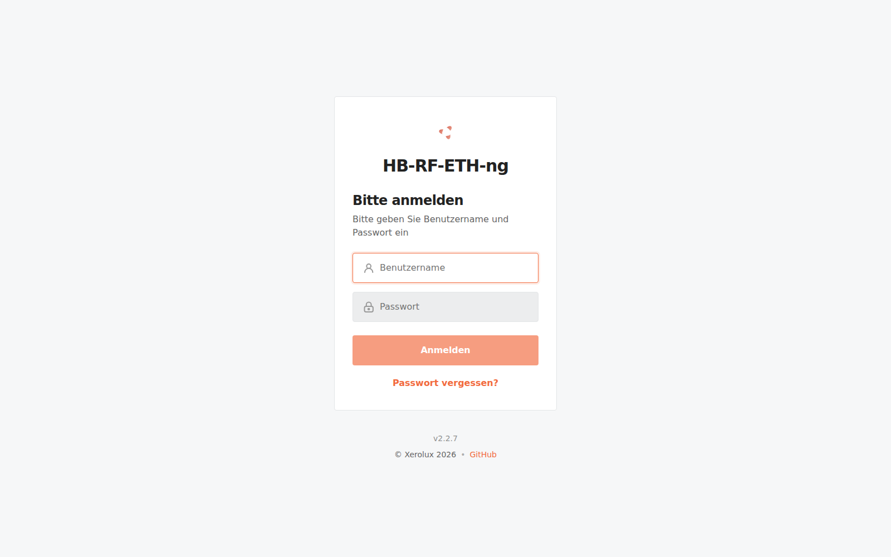
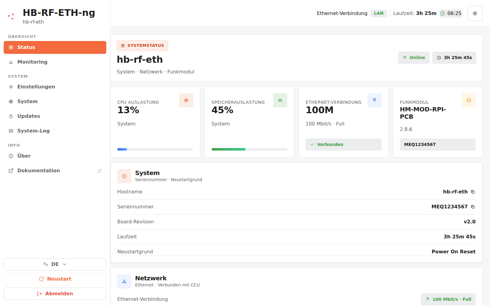
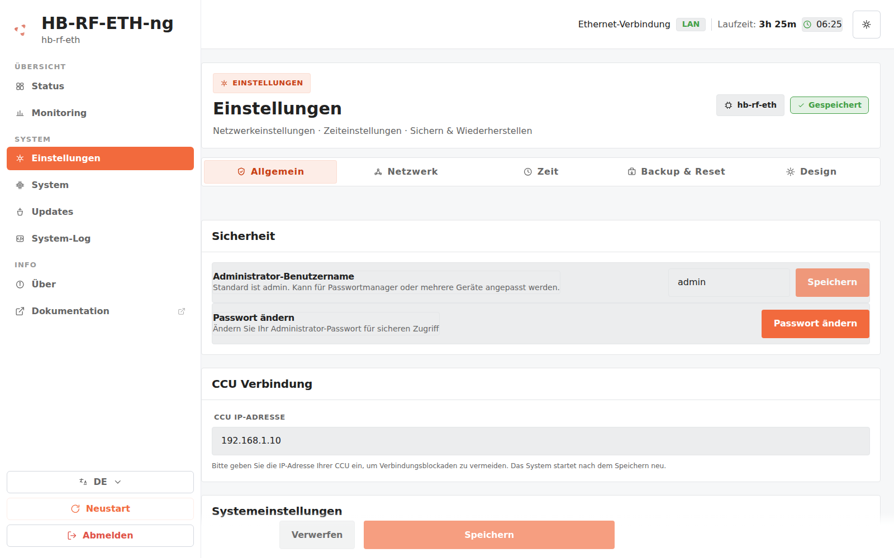
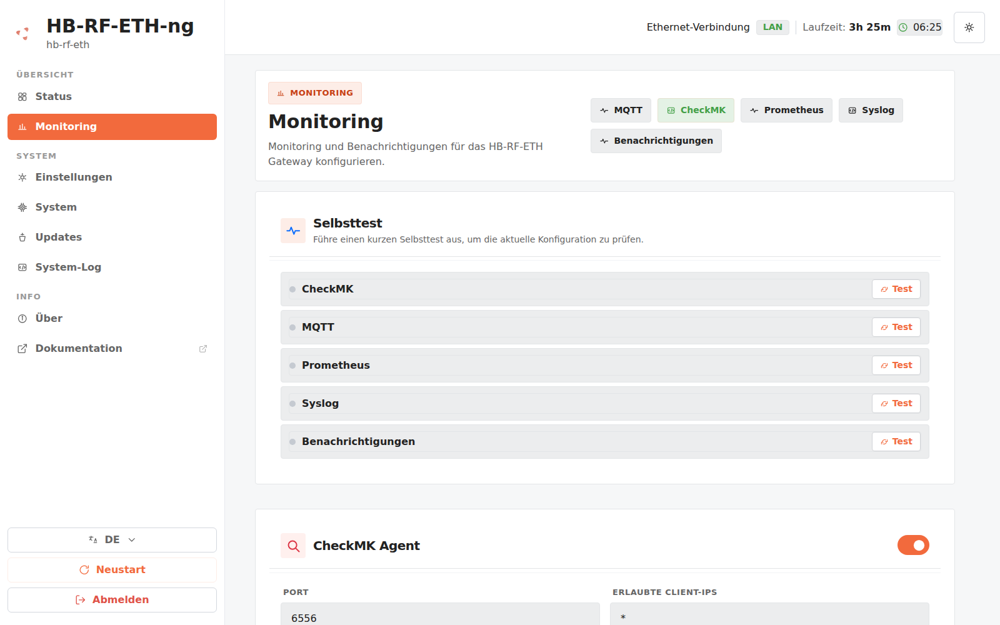
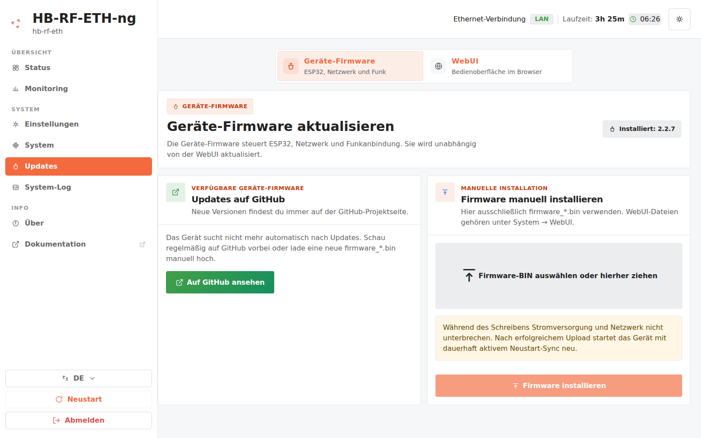
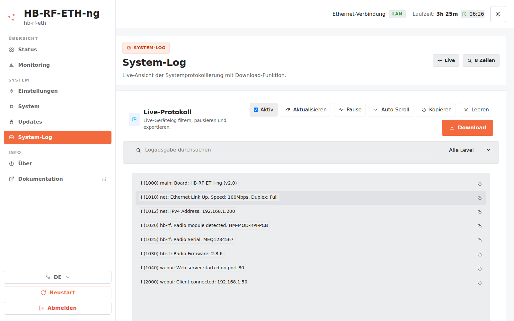
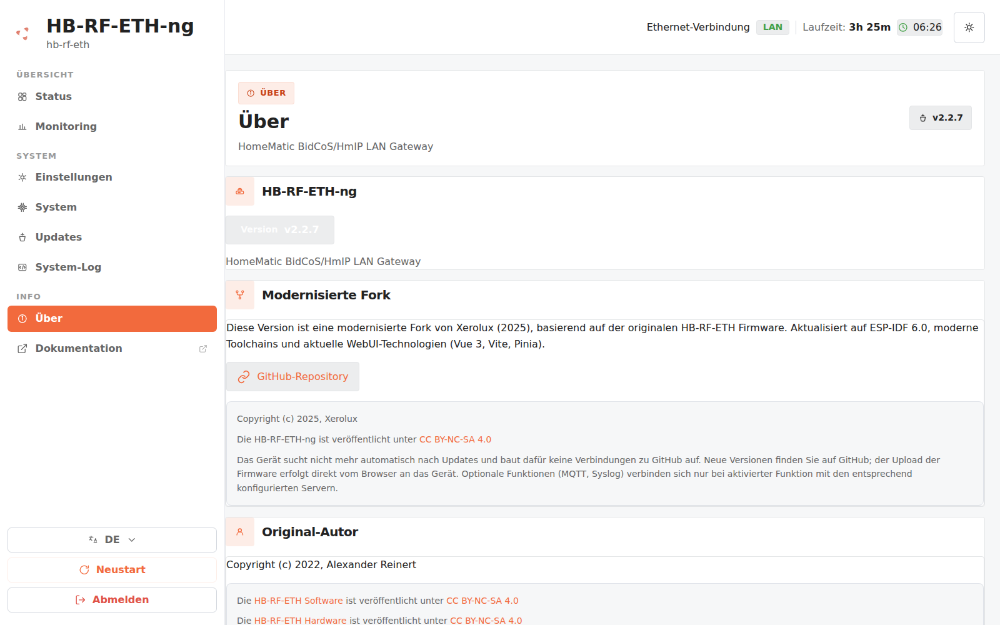

<div align="center">

# HB-RF-ETH-ng

**Modernisierte HomeMatic Netzwerk-Firmware | ESP-IDF 6.1**

[![GitHub Release][releases-shield]][releases]
[![GitHub Activity][commits-shield]][commits]
[![License][license-shield]](LICENSE.md)

[![Buy Me A Coffee][buymeacoffee-badge]][buymeacoffee]
[](https://ts.la/sebastian564489)

[](https://github.com/Xerolux/HB-RF-ETH-ng/actions/workflows/release.yml)

</div>

## Modernisierte Fork von Xerolux (2025)

Diese Version ist eine modernisierte und aktualisierte Fork der originalen HB-RF-ETH Firmware von Alexander Reinert. Die Firmware basiert auf ESP-IDF 6.1 und ist für moderne Toolchains optimiert.

> Alle detaillierten Änderungen pro Version finden Sie im [CHANGELOG.md](CHANGELOG.md).

### Worum es geht
Dieses Repository enthält die Firmware für die HB-RF-ETH Platine, welches es ermöglicht, ein Homematic Funkmodul HM-MOD-RPI-PCB oder RPI-RF-MOD per Netzwerk an eine debmatic oder piVCCU3 Installation anzubinden.

Hierbei gilt, dass bei einer debmatic oder piVCCU3 Installation immer nur ein Funkmodul angebunden werden kann, egal ob die Anbindung direkt per GPIO Leiste, USB mittels HB-RF-USB(-2) Platine oder per HB-RF-ETH Platine erfolgt.

---

📖 **Umfassende Dokumentation zu Funktionen, Installation, Home Assistant Integration und vielem mehr finden Sie im [offiziellen Wiki](https://github.com/Xerolux/HB-RF-ETH-ng/wiki).**

---

### Kurzüberblick
- Firmware für HB-RF-ETH mit Unterstützung für `HM-MOD-RPI-PCB`, `RPI-RF-MOD` und `HmIP-RFUSB`
- Moderne WebUI auf Basis von Vue 3, Vite und Bootstrap 5 (Dark/Light; Deutsch, Englisch, Französisch und Italienisch)
- Login mit Benutzername und Passwort: Standard-Benutzername `admin`, das bestehende Administrator-Passwort bleibt nach Updates erhalten und der Benutzername kann in den Einstellungen geändert werden.
- Dashboard, Kopfzeile und Browser-Tab zeigen den unter Einstellungen/Netzwerk gesetzten Hostnamen, damit mehrere HB-RF-ETH-ng Geräte sofort unterscheidbar sind.
- System-Log bleibt nach Aktivierung auch über einen Reboot aktiv; beim Deaktivieren bleibt es nach dem nächsten Start wieder aus.
- **Monitoring via MQTT** (mit Home Assistant Auto-Discovery, TLS/mTLS, Kommando-Token) und CheckMK
- Manuelle Firmware-Updates per `.bin`-Datei-Upload in der WebUI (automatische
  Update-Suche, URL-OTA und MQTT/Home-Assistant-OTA wurden entfernt)
- ESP-IDF 6.1 Toolchain (native `idf.py` Builds), GCC 15.2 (xtensa-esp-elf)

### Login nach Update
Nach dem Update auf eine Version mit Benutzername-Pflicht muss die Anmeldung einmalig mit dem Standard-Benutzernamen `admin` und dem bisherigen Administrator-Passwort erfolgen. Alte gespeicherte Browser-Sessions werden dabei aus Sicherheitsgründen ungültig. Der Benutzername kann anschließend unter **Einstellungen > Allgemein > Sicherheit** geändert werden, z.B. für Passwortmanager oder Installationen mit mehreren Geräten.

### Backup & Restore
Backups enthalten vollständig alle wiederherstellbaren Benutzereinstellungen: Administrator-Zugangsdaten, Netzwerk, Zeit, LED, Design/Akzentfarbe sowie sämtliche Monitoring-Konfigurationen einschließlich MQTT-/Benachrichtigungs-Zugangsdaten, Zertifikaten und privaten Schlüsseln. Die WebUI ergänzt die gewählte Sprache und die Experimentell-Präferenz.

> **Sicherheit:** Die JSON-Sicherung enthält Passwörter, Tokens, Zertifikate und gegebenenfalls private Schlüssel im Klartext. Die Datei muss wie ein Passwort sicher verwahrt und darf nicht veröffentlicht werden. Flüchtige Laufzeitdaten wie Sitzungs-Token, Update-Cache, Crash-Snapshot und letzter Resetgrund werden bewusst nicht gesichert.

> **Mehrere Geräte:** Die JSON-Datei darf mit einem Texteditor angepasst und anschließend auf weiteren Geräten eingespielt werden. Vor dem Import müssen insbesondere Hostname, statische IP-Adresse, Administrator-Passwort und gerätespezifische MQTT-Werte geprüft werden, damit keine Adress-, Login- oder Topic-Konflikte entstehen.

> Die vollständige MQTT-API-Referenz (alle Status-, Event- und Command-Topics,
> HA-Entitäten, TLS-Konfiguration, Sicherheitsmodell) findet sich im
> [Wiki – MQTT-Sektion](docs/WIKI.md#home-assistant-mqtt-integration).

### Entwickler-Build (ESP-IDF 6.1)
```bash
./scripts/setup_esp_idf.sh
. ~/esp-idf/export.sh

cd webui
npm ci
npm run build
cd ..
python3 rename_webui_files.py

./idf.py build
```

> **Wichtig — IDF-Patch (Errata WDT-3.15, Issue #362):** Vor dem ersten Build
> einmalig `bash scripts/patch_idf_eco3_fix.sh ~/esp-idf` ausführen. Das Skript
> aktiviert den ESP32-v3.x-Cache-Livelock-Watchdog-Workaround
> (`CONFIG_ESP32_ECO3_CACHE_LOCK_FIX`) auch auf Boards ohne PSRAM — ohne ihn
> können Rev-3-Chips spurlos per Interrupt-Watchdog resettet werden. Die CI wendet
> den Patch automatisch an; auf Silicon ≤ v2 ist er ein No-Op.

> Vor jeder Styling-Änderung an der WebUI bitte [`docs/WEBUI_DESIGN_SYSTEM.md`](docs/WEBUI_DESIGN_SYSTEM.md) lesen — die verbindliche Design-Spezifikation (Zwei-Theme-System, Farbpaletten, Tokens).

### Update- und Release-Hinweise
- Das Gerät sucht nicht automatisch nach neuen Versionen und installiert keine
  Firmware aus URLs oder über MQTT/Home Assistant.
- Releases auf GitHub sind die Quelle für Release Notes und Artefakte. Laden Sie
  dort die gewünschte `firmware_*.bin` herunter und installieren Sie sie als
  lokale Datei über die WebUI.
- Für produktive Systeme sollten bevorzugt Stable-Releases verwendet werden; Pre-Releases eignen sich zum Vorabtesten neuer Fixes.

### Screenshots
Die Aufnahmen zeigen die aktuelle WebUI im Auslieferungszustand (helles Theme,
Akzentfarbe `#f26a3d`). Theme und Akzentfarbe lassen sich unter
*Einstellungen → Design* umstellen.

| Anmeldung | Status (Dashboard) |
| :---: | :---: |
|  |  |

| Einstellungen | Monitoring |
| :---: | :---: |
|  |  |

| Updates (Geräte-Firmware) | System-Log |
| :---: | :---: |
|  |  |

| Über |
| :---: |
|  |

> Die Screenshots werden aus der laufenden WebUI erzeugt und nicht von Hand
> nachbearbeitet. Neu aufnehmen mit:
> `cd webui && npm install && npx playwright test tests/generate_assets.spec.js`

### Danksagung
Ein großer Dank geht an **Alexander Reinert** für die Entwicklung der originalen HB-RF-ETH Firmware und Hardware. Seine Arbeit bildet die Grundlage für diese modernisierte Version.

### Lizenz
Die Firmware steht unter Creative Commons Attribution-NonCommercial-ShareAlike 4.0 Lizenz.

<!-- Links -->
[releases-shield]: https://img.shields.io/github/release/Xerolux/HB-RF-ETH-ng.svg?style=for-the-badge
[releases]: https://github.com/Xerolux/HB-RF-ETH-ng/releases
[downloads-shield]: https://img.shields.io/github/downloads/Xerolux/HB-RF-ETH-ng/latest/total.svg?style=for-the-badge
[commits-shield]: https://img.shields.io/github/commit-activity/y/Xerolux/HB-RF-ETH-ng.svg?style=for-the-badge
[commits]: https://github.com/Xerolux/HB-RF-ETH-ng/commits/main
[license-shield]: https://img.shields.io/github/license/Xerolux/HB-RF-ETH-ng.svg?style=for-the-badge
[buymeacoffee]: https://www.buymeacoffee.com/xerolux
[buymeacoffee-badge]: https://img.shields.io/badge/-Buy%20Me%20A%20Coffee-FFDD00?style=for-the-badge&logo=buy-me-a-coffee&logoColor=black
